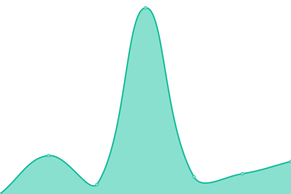

# [📈 Live Status](https://alex-bluetec.github.io/upptime-test): <!--live status--> **🟧 Partial outage**

This repository contains the open-source uptime monitor and status page for [Alex](https://alex-bluetec.github.io/upptime-test), powered by [Upptime](https://github.com/upptime/upptime).

With [Upptime](https://upptime.js.org), you can get your own unlimited and free uptime monitor and status page, powered entirely by a GitHub repository. We use [Issues](https://github.com/alex-bluetec/upptime-test/issues) as incident reports, [Actions](https://github.com/alex-bluetec/upptime-test/actions) as uptime monitors, and [Pages](https://alex-bluetec.github.io/upptime-test) for the status page.

<!--start: status pages-->
<!-- This summary is generated by Upptime (https://github.com/upptime/upptime) -->
<!-- Do not edit this manually, your changes will be overwritten -->
<!-- prettier-ignore -->
| URL | Status | History | Response Time | Uptime |
| --- | ------ | ------- | ------------- | ------ |
|  [Bluetec LLC](https://www.bluetecllc.com) | 🟩 Up | [bluetec-llc.yml](https://github.com/alex-bluetec/upptime-test/commits/HEAD/history/bluetec-llc.yml) | 

 364ms
     
 | 

<a href="https://alex-bluetec.github.io/upptime-test/history/bluetec-llc">100.00%</a>
    

|  [Buddy](https://www.buddy.insure) | 🟩 Up | [buddy.yml](https://github.com/alex-bluetec/upptime-test/commits/HEAD/history/buddy.yml) | 

 1568ms
     
 | 

<a href="https://alex-bluetec.github.io/upptime-test/history/buddy">100.00%</a>
    

|  [BuddySpace](https://www.buddyspace.squarespace.com) | 🟥 Down | [buddy-space.yml](https://github.com/alex-bluetec/upptime-test/commits/HEAD/history/buddy-space.yml) | 

 0ms
     
 | 

<a href="https://alex-bluetec.github.io/upptime-test/history/buddy-space">0.01%</a>
    

|  [Buddy-API](https://api.buddyinsurance.com/ping) | 🟩 Up | [buddy-api.yml](https://github.com/alex-bluetec/upptime-test/commits/HEAD/history/buddy-api.yml) | 

 311ms
     
 | 

<a href="https://alex-bluetec.github.io/upptime-test/history/buddy-api">0.27%</a>
    

<!--end: status pages-->

[**Visit our status website →**](https://alex-bluetec.github.io/upptime-test)

## 📄 License

- Powered by: [Upptime](https://github.com/upptime/upptime)
- Code: [MIT](./LICENSE) © [Alex](https://alex-bluetec.github.io/upptime-test)
- Data in the `./history` directory: [Open Database License](https://opendatacommons.org/licenses/odbl/1-0/)
